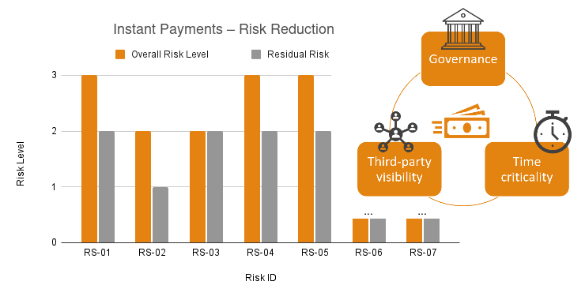
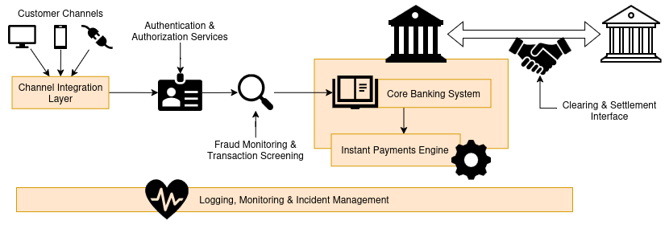

# ⚡ Consulting Case – DORA Readiness for Instant Payments  

This **simulated cyber security consulting case** delivers a **DORA readiness assessment** for a **mid-sized EU retail bank**, with a targeted focus on **SEPA Instant Credit Transfers (SCT Inst)** as a critical ICT-supported service. The case is designed to reflect how DORA applies in practice to real-time payment services that rely on complex ICT landscapes, strict availability requirements, and multiple internal and external dependencies.

The engagement demonstrates how **DORA (EU 2022/2554)** regulatory expectations can be translated into **service-centric ICT risk analysis**, **management-level risk prioritisation**, and a **pragmatic, phased remediation roadmap** suitable for executive decision-making and supervisory dialogue, rather than a purely technical or checklist-driven compliance exercise.




> ⚠️ **Disclaimer**  
> The client, data, and environment are fictional. The **methodology, structure, and deliverables reflect real-world financial services consulting practices**.

---

## 🧭 What Was the Objective?

The objective of this engagement was to:

- Assess **DORA readiness** for a **critical ICT-supported service** (instant payments)
- Identify **material ICT risks** affecting service availability, integrity, and resilience
- Highlight **gaps** against selected DORA Articles (governance, detection, response, recovery)
- Develop a **risk-based remediation roadmap** proportionate to a mid-sized EU bank
- Present results in a **management- and supervisor-ready format**

This engagement is a **readiness and gap assessment**, not a formal compliance audit.

---

## 🔍 What Was in Scope?

### Business Service in Scope
- **SEPA Instant Credit Transfers (Instant Payments)**

Including:
- Real-time transaction processing
- Core payment engines and interfaces
- Clearing and settlement connectivity
- Supporting ICT services required for availability and integrity

Instant payments are a strong DORA use case due to:
- Real-time processing with no settlement buffer
- High availability and integrity requirements
- Strong dependency on ICT systems and third parties

The following graphic shows an assumed **service-centric logical architecture** of the instant payment service:


---

### Regulatory Scope (DORA)

The assessment focuses on selected **DORA ICT risk management requirements**:

- Articles **5–12** (governance, risk management, protection, detection, response, recovery)
- Service-centric ICT risk identification
- High-level incident and recovery capabilities

Out of scope:
- Advanced threat-led penetration testing (TLPT)
- Evidence-based audits or control testing
- Regulatory reporting submissions
- Deep-dive third-party risk assessments

---

## 🧠 What Assumptions Were Made?

This is a **simulated consulting case**, based on the following assumptions:

- The client environment is **hypothetical but representative** of a mid-sized EU retail bank
- Current-state practices are **assumed**, not evidence-tested
- Third-party providers are considered **at a logical and service level only**
- The assessment reflects a **point-in-time view** of DORA readiness

These assumptions are consistent with early-stage **regulatory readiness assessments**.

---

## 🧩 What Frameworks & Methods Were Used?

### Regulatory & Reference Frameworks
- **Digital Operational Resilience Act (EU) 2022/2554**
- **ISO/IEC 27001:2022** (control reference)
- **NIST Cybersecurity Framework (CSF) 2.0** (control reference)

---

### Consulting Methodology

The engagement follows a structured, consulting-style approach:

1. **Service definition**  
   Identification of instant payments as a critical ICT-supported service

2. **Logical payment architecture analysis**  
   Decomposition into 8 core ICT components to enable service-centric risk analysis

3. **DORA requirement mapping**  
   Mapping DORA Articles to control objectives and service implications

4. **ICT risk scenario identification**  
   Identification of plausible, service-level ICT risk scenarios (not control checklists)

5. **Qualitative risk prioritisation**  
   Likelihood / impact assessment and explicit risk treatment decisions

6. **Phased remediation planning**  
   Development of a 0–9 month remediation roadmap aligned with risk criticality

Each step is documented and explained in its respective document in `doc/`.

---

## ✨ Key Skills Demonstrated

This project demonstrates skills relevant to **cyber security, ICT risk, and regulatory consulting**:

* **DORA interpretation & application**
* **ICT risk management (service-centric)**
* **Operational resilience & incident management**
* **Regulatory gap assessment**
* **Risk prioritisation & remediation planning**
* **Executive-level communication**
* **Consulting-style documentation and structuring**

---

## 🤖 Use of AI Tools

This project combines independent regulatory analysis and consulting methodologies with AI-assisted drafting (ChatGPT) to refine structure, wording, and clarity.
All analysis, risk judgments, and conclusions are the author's own.

---

## 📂 Repository Structure

```shell
.
├── doc/ – "Consulting documentation"
|   ├── 01_Engagement_Overview.md
|   ├── 02_Instant_Payments_Architecture.md
|   ├── 03_DORA_Control_Mapping.md
|   ├── 04_DORA_Gap_Assessment.md
|   ├── 05_ICT_Risk_Scenarios.md
|   ├── 06_ICT_Risk_Register.md
|   └── 07_ICT_Risk_Remediation_Roadmap.md
├── images/ – "Diagrams and visuals"
├── All_Tables.xlsx – "All tables consolidated in one file"
├── Executive_Pitch.pptx
├── Executive_Summary.md
├── LICENSE
└── README.md
````

## 📜 License
This project is licensed under the **MIT License**. See the [LICENSE](./LICENSE) file for more details.